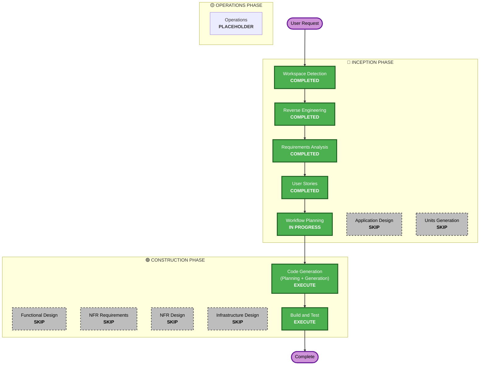

# Execution Plan

## Detailed Analysis Summary

### Transformation Scope (Brownfield Only)
- **Transformation Type**: Application-level change.
- **Primary Changes**: Integrate Web Audio oscillator synthesis into virtual keyboard triggers, update Zustand store state with mode selection (`inputMode: 'mic' | 'synth'`), create mode switch toggle inside UI header, and manage microphone suspension cleanly.
- **Related Components**:
  - `src/store/audioSlice.ts` / `src/store/appStore.ts`: Add `inputMode` and `setInputMode(mode)`.
  - `src/features/audio/useAudioEngine.ts` / `src/features/pitch/usePitchDetector.ts`: React to `inputMode === 'synth'` by stopping/releasing mic and halting detection frames.
  - `src/features/ui/AppLayout.tsx`: Add Mode Switch toggle buttons, show Synth active HUD state, and disable mic-specific controls.
  - `src/features/keyboard/PianoKeyboard.tsx`: Trigger monophonic audio synthesis when clicking/keyboard-pressing SVG keys.
  - `src/features/keyboard/synthesizer.ts`: New file housing standard Web Audio oscillator tone outputs and ADSR envelopes.

### Change Impact Assessment
- **User-facing changes**: Yes — user gets a Mode Toggle header control, synthesized sound output on virtual key click (when in Synth mode), and a modified HUD active note state during Synth play.
- **Structural changes**: No — uses existing React component boundaries.
- **Data model changes**: No — only in-memory Zustand UI slices are updated.
- **API changes**: No.
- **NFR impact**: None.

### Component Relationships (Brownfield Only)
```markdown
## Component Relationships
- **Primary Component**: src/features/keyboard/PianoKeyboard.tsx (dispatches click play event)
- **Infrastructure Components**: None
- **Shared Components**: src/features/keyboard/synthesizer.ts (custom audio synthesis helper module)
- **Dependent Components**: src/features/ui/AppLayout.tsx (renders mode selection controls)
- **Supporting Components**: src/store/audioSlice.ts (maintains inputMode state)
```

### Risk Assessment
- **Risk Level**: Low.
- **Rollback Complexity**: Easy — code remains isolated to client-only packages.
- **Testing Complexity**: Moderate — requires mocking Web Audio oscillators and testing layout mode transitions in Vitest.

---

## Workflow Visualization

### Mermaid Diagram


### Text Alternative
- **Start**: User requests a new key press sound synthesis feature.
- **Workspace Detection**: Scan and detect project structure (COMPLETED).
- **Reverse Engineering**: Analyze current audio engine, pitch tracker, and keyboard modules (COMPLETED).
- **Requirements Analysis**: Verify scope details (e.g. modes, polyphony, synth type) with clarifying questions (COMPLETED).
- **User Stories**: Write FEAT-11 and update personas (COMPLETED).
- **Workflow Planning**: Select phases to execute/skip (IN PROGRESS).
- **Application Design**: Skip — does not modify system structure.
- **Units Planning/Generation**: Skip — groups all changes into a single workspace unit (`Unit 5`).
- **Functional Design / NFR Design / Infrastructure Design**: Skip — changes are straightforward UI/audio implementations requiring no architecture changes.
- **Code Generation**: Execute planning and file changes (EXECUTE).
- **Build and Test**: Validate with full Vitest regression tests (EXECUTE).

---

## Phases to Execute

### 🔵 INCEPTION PHASE
- [x] Workspace Detection (COMPLETED)
- [x] Reverse Engineering (COMPLETED)
- [x] Requirements Analysis (COMPLETED)
- [x] User Stories (COMPLETED)
- [x] Execution Plan (IN PROGRESS)
- [ ] Application Design - SKIP
  - **Rationale**: The change fits within existing component and state layout structures; no new core components or routing definitions are required.
- [ ] Units Planning - SKIP
  - **Rationale**: Not required as this is a single self-contained task.
- [ ] Units Generation - SKIP
  - **Rationale**: The work is compiled into a single workspace unit (`Unit 5: Sound Synthesis & Mode Controls`) which executes consecutively.

### 🟢 CONSTRUCTION PHASE
- [ ] Functional Design - SKIP
  - **Rationale**: Standard React component UI bindings and Web Audio API play calls do not need detailed schematic or data modeling diagrams.
- [ ] NFR Requirements - SKIP
  - **Rationale**: Latency constraints (<100ms) are already established in v1.0. No new scaling or hosting specifications apply.
- [ ] NFR Design - SKIP
  - **Rationale**: Sound generation leverages standard browser-native context features, requiring no advanced design patterns.
- [ ] Infrastructure Design - SKIP
  - **Rationale**: Standard static code updates. No CDK/CloudFormation alterations.
- [ ] Code Generation - EXECUTE (ALWAYS)
  - **Rationale**: Create `synthesizer.ts`, add mode switch controls, and hook keyboard play handlers.
- [ ] Build and Test - EXECUTE (ALWAYS)
  - **Rationale**: Ensure all 253+ tests pass and implement new unit/integration tests covering the mode switch states.

### 🟡 OPERATIONS PHASE
- [ ] Operations - PLACEHOLDER
  - **Rationale**: Standard GitHub Pages push deployment.

---

## Package Change Sequence (Brownfield Only)
*Note: Single monorepo package. No multi-package updates required.*

## Estimated Timeline
- **Total Phases**: 2 (Inception + Construction)
- **Estimated Duration**: ~1 hour execution

## Success Criteria
- **Primary Goal**: Synthesize soft monophonic tone playback when clicking virtual keys in Synth Mode while preventing mic loop feedback.
- **Key Deliverables**:
  - `src/features/keyboard/synthesizer.ts` (monophonic oscillator engine)
  - Mode Switch control in `AppLayout.tsx`
  - Updated store actions in `audioSlice.ts`
  - Modified listener triggers in `useAudioEngine.ts` and `usePitchDetector.ts`
- **Quality Gates**:
  - Zero TypeScript compile errors (`npm run lint` matches `tsc --noEmit`).
  - Unit/integration test suites pass with >70% coverage.
