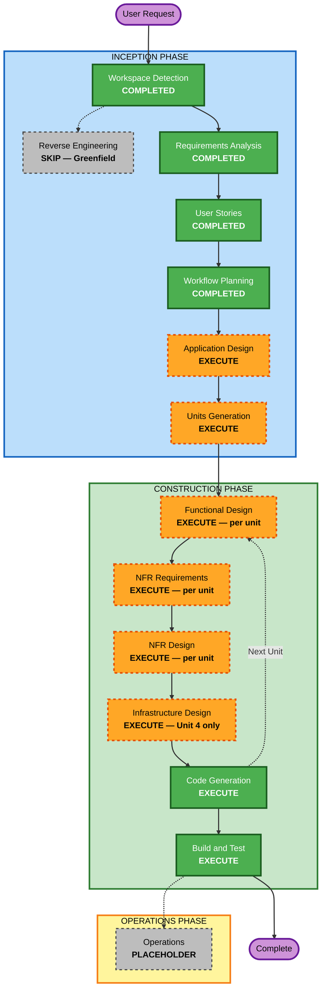

# PianoVora — Execution Plan

**Date**: 2026-05-09  
**Version**: 1.0

---

## Detailed Analysis Summary

### Change Impact Assessment

| Area | Impact | Detail |
|---|---|---|
| User-facing changes | Yes — entire product | All 10 stories are user-facing; every feature directly affects the practice experience |
| Structural changes | Yes — new system | New React + Vite app with 4 distinct technical layers built from scratch |
| Data model changes | Minimal | No database; state shapes for detected note, note history, theme, and audio status defined via Zustand store |
| API changes | N/A | Browser-native APIs only (Web Audio API, getUserMedia); no service-to-service APIs |
| NFR impact | Significant | <100ms latency, 60fps animations, WCAG 2.1 AA, zero audio off-device, PBT partial enforcement |

### Risk Assessment

| Attribute | Rating | Detail |
|---|---|---|
| **Risk Level** | Medium | Multiple browser API constraints; 60fps canvas performance; WCAG 2.1 AA; cross-browser Web Audio API quirks (Safari) |
| **Rollback Complexity** | Easy | Static Netlify deploy; each deployment is independently addressable |
| **Testing Complexity** | Moderate | Browser API mocking (getUserMedia, AudioContext), canvas rendering tests, Playwright e2e, fast-check PBT |

---

## Proposed Unit Breakdown (4 Units)

The system decomposes naturally into 4 independently buildable and testable units. Units execute sequentially as Units 2–3 depend on Unit 1's audio buffer interface.

| Unit | Name | Scope | Stories |
|---|---|---|---|
| **Unit 1** | Audio Engine | getUserMedia, AudioContext, AnalyserNode, RMS noise gate, stop/restart, audio level signal | FEAT-01, FEAT-09 (audio layer) |
| **Unit 2** | Pitch Detection | pitchy integration, waveform buffer processing, frequency-to-MIDI mapping, note name calculation, Zustand store (detectedNote, noteHistory) | FEAT-02, FEAT-07 (data) |
| **Unit 3** | Piano Keyboard & Visual Feedback | SVG 88-key layout, Canvas animation engine (sparkle/glow, 60fps), neon theme system (Cyber/Aurora/Sunset), note name overlay, key scroll centring, clickable key interaction | FEAT-03, FEAT-04, FEAT-05, FEAT-10 |
| **Unit 4** | UI Shell & Features | Dark theme layout, responsive design (360px+), mic toggle, audio level meter component, sensitivity slider, note history panel, onboarding modal, error/fallback states, theme selector, Netlify deployment config | FEAT-01 (UI), FEAT-06, FEAT-07 (UI), FEAT-08, FEAT-09 (UI), FEAT-05 (selector) |

**Unit Dependency Order**: Unit 1 → Unit 2 → Unit 3 → Unit 4

---

## Workflow Visualization

### Mermaid Diagram



### Text Alternative

```
INCEPTION PHASE
  Workspace Detection      — COMPLETED
  Reverse Engineering      — SKIP (Greenfield)
  Requirements Analysis    — COMPLETED
  User Stories             — COMPLETED
  Workflow Planning        — COMPLETED
  Application Design       — EXECUTE
  Units Generation         — EXECUTE

CONSTRUCTION PHASE (per unit, 4 units sequential)
  Unit 1: Audio Engine
    Functional Design      — EXECUTE
    NFR Requirements       — EXECUTE
    NFR Design             — EXECUTE
    Infrastructure Design  — SKIP
    Code Generation        — EXECUTE
  Unit 2: Pitch Detection
    Functional Design      — EXECUTE
    NFR Requirements       — EXECUTE
    NFR Design             — EXECUTE
    Infrastructure Design  — SKIP
    Code Generation        — EXECUTE
  Unit 3: Keyboard & Visual Feedback
    Functional Design      — EXECUTE
    NFR Requirements       — EXECUTE
    NFR Design             — EXECUTE
    Infrastructure Design  — SKIP
    Code Generation        — EXECUTE
  Unit 4: UI Shell & Features
    Functional Design      — EXECUTE
    NFR Requirements       — EXECUTE
    NFR Design             — EXECUTE
    Infrastructure Design  — EXECUTE (Netlify config)
    Code Generation        — EXECUTE
  Build and Test           — EXECUTE

OPERATIONS PHASE
  Operations               — PLACEHOLDER
```

---

## Phases to Execute

### INCEPTION PHASE

- [x] Workspace Detection — **COMPLETED**
- [x] Reverse Engineering — **SKIPPED** (greenfield, no existing code)
- [x] Requirements Analysis — **COMPLETED**
- [x] User Stories — **COMPLETED**
- [x] Workflow Planning — **IN PROGRESS**
- [ ] Application Design — **EXECUTE**
  - *Rationale*: New system with 4 distinct components and a shared Zustand store. Component interfaces, method signatures, and dependency relationships need definition before code generation.
- [ ] Units Generation — **EXECUTE**
  - *Rationale*: 4 units with clear boundaries and a sequential dependency order need formal documentation to guide per-unit construction.

### CONSTRUCTION PHASE

**Per-Unit Stages** (applied to each of the 4 units in sequence):

- [ ] Functional Design — **EXECUTE per unit**
  - *Rationale*: Each unit has distinct business logic (audio buffering, frequency math, canvas animation, UI composition) requiring detailed design before code generation.
- [ ] NFR Requirements — **EXECUTE per unit**
  - *Rationale*: Performance (<100ms latency for Units 1–2, 60fps for Unit 3), WCAG 2.1 AA (Unit 4), PBT partial enforcement (Units 2), cross-browser compatibility (all units).
- [ ] NFR Design — **EXECUTE per unit**
  - *Rationale*: Follows NFR Requirements; patterns for performance optimisation (requestAnimationFrame, AudioWorklet consideration), accessibility markup, and PBT generator design need to be incorporated into design artefacts.
- [ ] Infrastructure Design — **EXECUTE Unit 4 only / SKIP Units 1–3**
  - *Rationale*: Netlify deployment config (netlify.toml, SPA routing, security headers for HTTPS) is part of Unit 4 scope. Units 1–3 have no infrastructure footprint.
- [ ] Code Generation — **EXECUTE per unit** (always)
- [ ] Build and Test — **EXECUTE** (always, after all 4 units complete)

### OPERATIONS PHASE

- [ ] Operations — **PLACEHOLDER** (future deployment and monitoring workflows)

---

## Success Criteria

| Criterion | Target |
|---|---|
| Note detection accuracy | >95% on 50 standard piano notes |
| End-to-end latency | <100ms (key strike to neon highlight, Chrome desktop) |
| Animation performance | 60fps sustained on mid-range 2020+ laptop |
| Responsive layout | Functional from 360px to 2560px |
| Accessibility | WCAG 2.1 AA automated audit pass |
| Browser compatibility | Chrome 110+, Firefox 110+, Safari 16+, Edge 110+ |
| Code coverage | >70% (Vitest + RTL) |
| Privacy | Zero audio data leaves device (verified) |
| PBT | fast-check round-trip and invariant tests passing for pitch detection pure functions |
