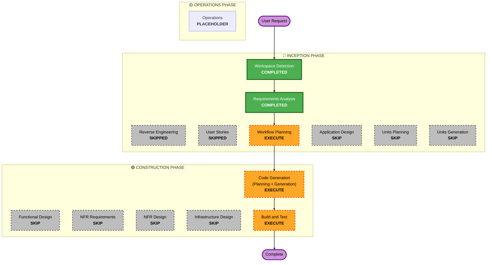

# Execution Plan - Mode Toggling Fix

## Detailed Analysis Summary

### Transformation Scope (Brownfield Only)
- **Transformation Type**: Single component fix.
- **Primary Changes**: Modifying `src/features/ui/AppLayout.tsx` to fix missing React imports and prevent the `wasListeningRef.current` tracking logic from being prematurely overwritten with a stale `isListening` state.
- **Related Components**: `src/features/ui/AppLayout.tsx`

### Change Impact Assessment
- **User-facing changes**: Yes. Switching from Synth Mode back to Mic Mode will automatically resume listening if the microphone was active before the user entered Synth Mode.
- **Structural changes**: No.
- **Data model changes**: No.
- **API changes**: No.
- **NFR impact**: No.

### Risk Assessment
- **Risk Level**: Low. The change is isolated to a single UI layout file.
- **Rollback Complexity**: Easy. Standard git reversion.
- **Testing Complexity**: Simple. Running the existing Vitest suite and adding/modifying mode switching tests.

## Workflow Visualization

### Mermaid Diagram

### Text Alternative
- **Phase 1: INCEPTION**
  - Workspace Detection: COMPLETED
  - Reverse Engineering: SKIPPED (stale check passed, current artifacts exist)
  - Requirements Analysis: COMPLETED (minimal depth)
  - User Stories: SKIPPED (bug fix with clear scope)
  - Workflow Planning: EXECUTE
  - Application Design: SKIP (no architectural modifications)
  - Units Planning: SKIP
  - Units Generation: SKIP
- **Phase 2: CONSTRUCTION**
  - Functional Design: SKIP
  - NFR Requirements: SKIP
  - NFR Design: SKIP
  - Infrastructure Design: SKIP
  - Code Generation: EXECUTE (modifying AppLayout.tsx)
  - Build and Test: EXECUTE (run unit tests and build step)
- **Phase 3: OPERATIONS**
  - Operations: PLACEHOLDER

## Phases to Execute

### 🔵 INCEPTION PHASE
- [x] Workspace Detection (COMPLETED)
- [x] Requirements Analysis (COMPLETED)
- [x] Workflow Planning (IN PROGRESS)
- [ ] Application Design - SKIP
  - **Rationale**: The change only affects a single UI wrapper and its hook tracking logic; no architectural/component boundaries are added or changed.
- [ ] Units Planning - SKIP
  - **Rationale**: No decomposition needed.
- [ ] Units Generation - SKIP
  - **Rationale**: Single unit of work.

### 🟢 CONSTRUCTION PHASE
- [ ] Functional Design - SKIP
  - **Rationale**: Logic is simple and well understood.
- [ ] NFR Requirements - SKIP
  - **Rationale**: No new NFRs.
- [ ] NFR Design - SKIP
  - **Rationale**: No new NFR patterns needed.
- [ ] Infrastructure Design - SKIP
  - **Rationale**: Pure application layer fix.
- [ ] Code Generation - EXECUTE (ALWAYS)
  - **Rationale**: To apply imports and event dependencies fixes.
- [ ] Build and Test - EXECUTE (ALWAYS)
  - **Rationale**: Required to ensure zero regressions across the codebase.

### 🟡 OPERATIONS PHASE
- [ ] Operations - PLACEHOLDER
  - **Rationale**: System deployment status verification.

## Estimated Timeline
- **Total Phases**: 2 (Inception, Construction)
- **Estimated Duration**: ~15 minutes

## Success Criteria
- **Primary Goal**: Switching back to Mic Mode automatically resumes listening state only if previously active, with zero runtime/compilation errors.
- **Key Deliverables**: Modified `src/features/ui/AppLayout.tsx` and passing tests.
- **Quality Gates**:
  - `npm run lint` compiles cleanly.
  - `npm run test:run` runs and all 266 unit tests pass.
