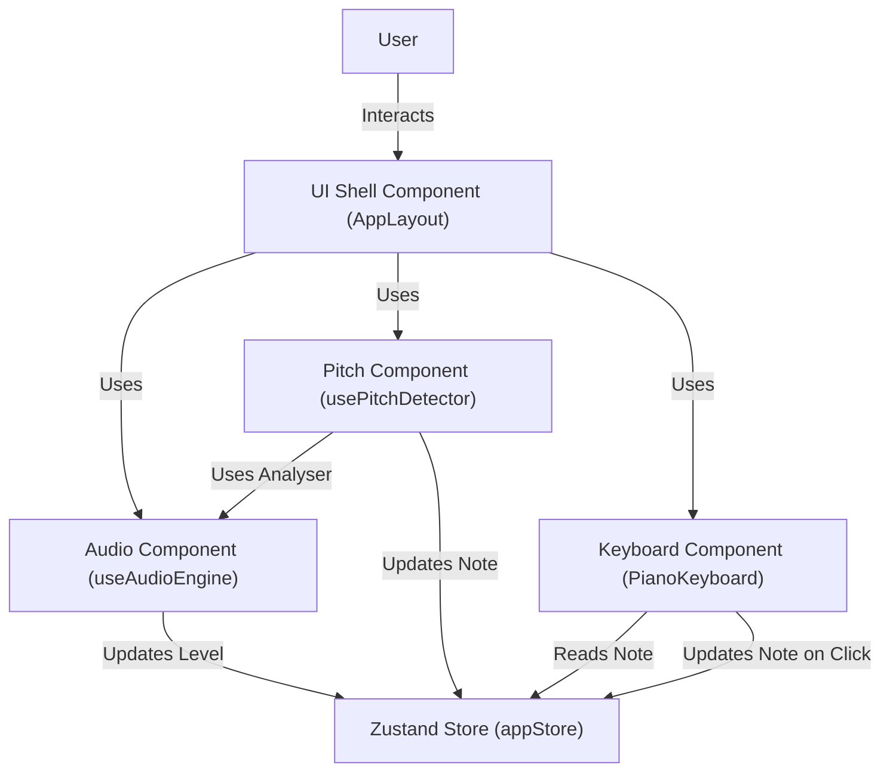
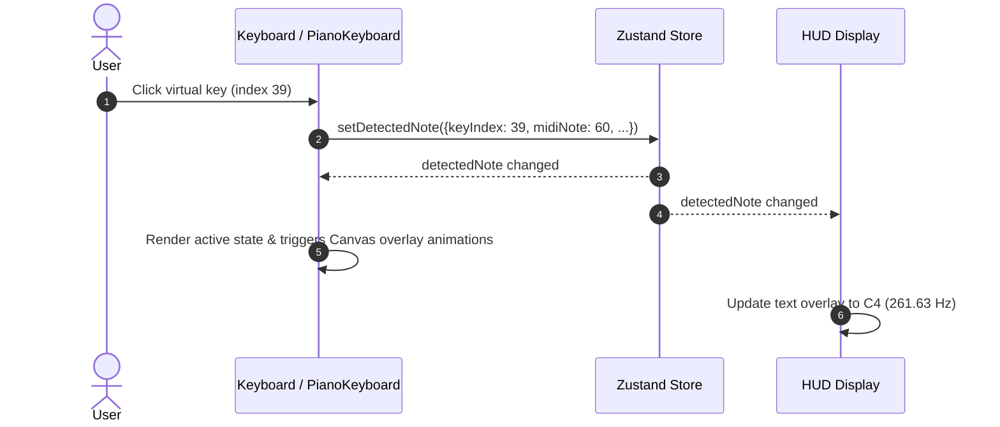
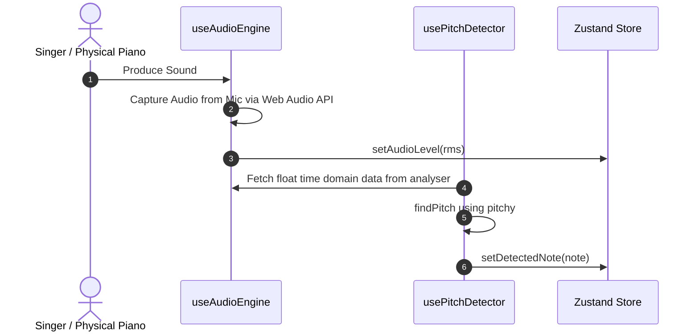

# System Architecture

## System Overview
PianoVora is a single-page web application structured as a client-only reactive system. State is centralized in a Zustand store, which triggers reactive rendering of UI controls and high-performance SVG/Canvas layers. Audio capture via Web Audio API and pitch estimation via the `pitchy` library operate client-side entirely.

## Architecture Diagram

### Mermaid Diagram

### Text Alternative
- **User**: The performer who plays piano keys or produces sounds.
- **UI Shell Component (AppLayout)**: Integrates and lays out all other sub-components, providing the responsive visual scaffolding.
- **Audio Component (useAudioEngine)**: Coordinates with Web Audio API, handles microphone permission, and publishes the RMS audio level.
- **Pitch Component (usePitchDetector)**: Consumes the raw analyser stream, performs frequency estimation, and publishes detected notes.
- **Keyboard Component (PianoKeyboard)**: Reads the active note state to colorize SVG keys and triggers sparkles on the canvas layer.
- **Zustand Store (appStore)**: Manages global, fast-updating application state (e.g., active note, microphone status, theme) to coordinate component updates.

## Component Descriptions
### Audio Engine Component
- **Purpose**: Low-latency browser microphone input stream wrapper.
- **Responsibilities**: Accesses user microphone, sets up analyser nodes, computes input level (RMS) at 60fps, and recovers from stream dropouts.
- **Dependencies**: `@/store/appStore`, `@/shared/constants`, `@/shared/types`
- **Type**: Application Hook (`src/features/audio/useAudioEngine.ts`)

### Pitch Detector Component
- **Purpose**: Translates audio time-domain frames into musical note values.
- **Responsibilities**: Runs YIN/McLeod autocorrelation using `pitchy`, validates accuracy/clarity, and updates store with DetectedNote object.
- **Dependencies**: `pitchy`, `@/store/appStore`, `@/shared/pianoGeometry`, `@/shared/constants`
- **Type**: Application Hook (`src/features/pitch/usePitchDetector.ts`)

### Keyboard Component
- **Purpose**: Interactive visual interface of a standard 88-key piano.
- **Responsibilities**: Draws white/black keys as SVG shapes, provides clickable button roles for accessibility, and renders high-performance animations on Canvas.
- **Dependencies**: `@/store/appStore`, `@/shared/pianoGeometry`
- **Type**: Application Component (`src/features/keyboard/PianoKeyboard.tsx`)

### UI Components (Theme/HUD/Layout)
- **Purpose**: Organises options, handles onboarding steps, and displays detected pitch text.
- **Responsibilities**: Displays detected note HUD, manages theme styles, shows sensitivity controls, and renders note history.
- **Dependencies**: `@/store/appStore`
- **Type**: Application Components (`src/features/ui/*`)

## Data Flow

### Workflow 1: Manual Key Click / Press

#### Mermaid Sequence Diagram

#### Text Alternative
1. User clicks/taps key on virtual on-screen keyboard (e.g. middle C / index 39).
2. `PianoKeyboard` calculates MIDI note (60) and sets it in the Zustand store via `setDetectedNote()`.
3. The store updates, notifying all subscribing components.
4. `PianoKeyboard` redraws the key in its active neon state and triggers canvas particle animations.
5. Note HUD display catches store update and displays "C4" and "261.63 Hz".

### Workflow 2: Microphone Audio Pitch Detection

#### Mermaid Sequence Diagram

#### Text Alternative
1. User plays a sound near the device's microphone.
2. `useAudioEngine` captures audio data from the browser's mic stream.
3. `useAudioEngine` calculates the volume level (RMS) and publishes it to the Zustand store via `setAudioLevel`.
4. `usePitchDetector` reads the raw float time-domain data directly from the audio analyser node.
5. `usePitchDetector` runs the `pitchy` pitch finder at ~30fps, evaluating frequency and clarity.
6. Once clarity is >0.90 and within the piano frequency range, `usePitchDetector` publishes the note details to the Zustand store.

## Integration Points
- **External APIs**: `navigator.mediaDevices.getUserMedia` (Browser Audio Capture API).
- **Databases**: None.
- **Third-party Services**: None.

## Infrastructure Components
- **CDK Stacks**: None (Standard frontend-only SPA).
- **Deployment Model**: Built with Vite and TypeScript as static HTML/JS/CSS assets. Configured for GitHub Pages/Netlify deployment.
- **Networking**: HTTPS is mandatory to enable `navigator.mediaDevices.getUserMedia`.
