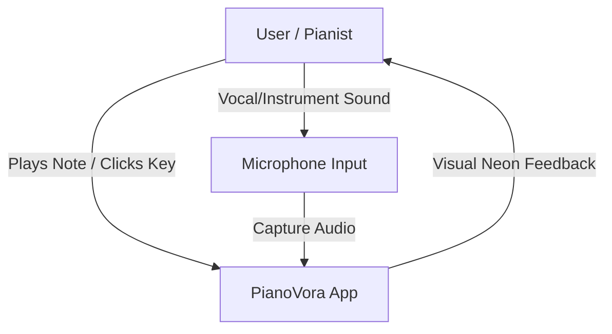

# Business Overview

## Business Context Diagram

### Mermaid Diagram

### Text Alternative
- **User / Pianist**: Interacts with the application by playing notes on a physical piano or clicking keys on the virtual on-screen keyboard. Receives visual neon feedback.
- **Microphone Input**: Captures the ambient sound produced by the pianist's performance.
- **PianoVora App**: Processes captured microphone audio, identifies pitch/frequency, and lights up the corresponding keys on screen with custom neon aesthetics and animations.

## Business Description
- **Business Description**: PianoVora is an interactive, browser-native piano practice utility. It assists piano students and musicians in practicing by capturing sound from their microphone, detecting note pitches in real time, and providing instant visual feedback on a virtual 88-key piano keyboard using premium neon aesthetics.
- **Business Transactions**:
  - *Audio Streaming & Permission Management*: Prompts user for microphone permission, starts/stops recording audio from the browser, and monitors volume level.
  - *Real-time Pitch Identification*: Analyzes audio signal to detect notes (MIDI/Frequency) from the full piano range (A0 to C8).
  - *Visual Feedback & Theme Customisation*: Updates the visual keyboard status (lighting up keys, rendering particle sparkle effects) according to detected pitches and custom styling themes.
  - *Manual Playground*: Allows clicking/focusing keys to trigger visual feedback directly without microphone input.
- **Business Dictionary**:
  - *MIDI Note*: Musical Instrument Digital Interface numeric representation of a note (21 to 108 for a standard 88-key piano).
  - *Frequency*: The rate of sound vibration, measured in Hertz (Hz), ranging from 27.5 Hz (A0) to 4186 Hz (C8).
  - *Neon Theme*: A custom curated styling palette (Cyber, Aurora, Sunset) that dictates key highlighting and sparkle animation colors.
  - *Noise Gate*: A threshold level below which sound signals are filtered out, suppressing background noise.

## Component Level Business Descriptions
### Audio Feature Component
- **Purpose**: Handles capturing and processing analog sound from the microphone.
- **Responsibilities**: Prompts for microphone access, computes volume level (RMS) in real time, and handles microphone reconnection.

### Pitch Feature Component
- **Purpose**: Interprets the raw sound waves to identify musical notes.
- **Responsibilities**: Detects fundamental frequencies, filters out background noise/harmonics, and maps frequencies to MIDI note numbers.

### Keyboard Feature Component
- **Purpose**: Renders the piano keyboard interface and visual effects.
- **Responsibilities**: Visualizes 88 white and black keys, scroll-aligns the active key, and manages 60fps canvas animations (sparkles and neon glow).

### UI Shell Feature Component
- **Purpose**: Wraps the features into a cohesive, responsive application shell.
- **Responsibilities**: Renders application header, control widgets (sensitivity slider, level meter, microphone toggle, theme selector), note history log, and onboarding tour overlay.
