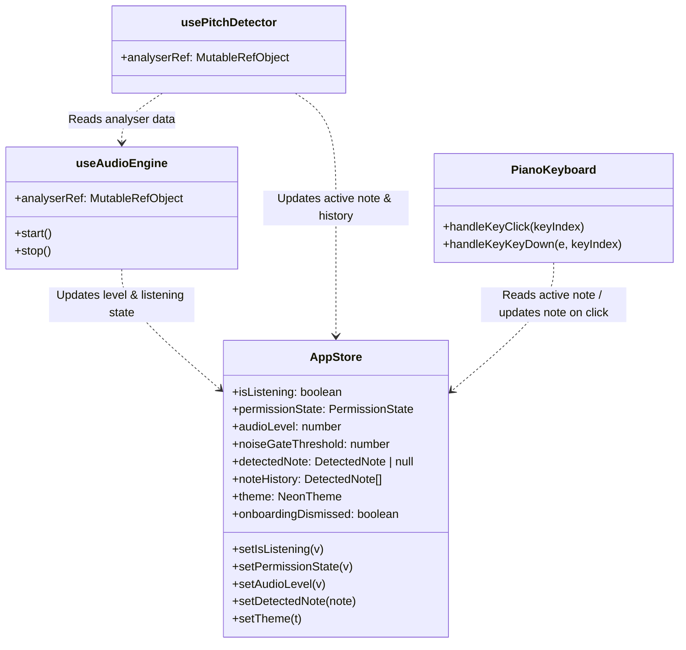

# Code Structure

## Build System
- **Type**: npm / Vite
- **Configuration**:
  - `package.json` - Defines dependencies, devDependencies, and build scripts.
  - `vite.config.ts` - Configures the Vite build system, React plugin, and path aliases (`@/`).
  - `tsconfig.json` - Configures TypeScript compiler settings in strict mode.

## Key Classes/Modules

### Mermaid Class Diagram

### Text Alternative
- **AppStore**: The main Zustand state coordinator. Provides read/write states for audio level, mic permission, detected pitch, theme, and onboarding.
- **useAudioEngine**: Coordinates stream capture and permission requests. Pushes RMS audio level measurements into the store.
- **usePitchDetector**: Periodically polls the analyser node buffer at ~30fps, estimates pitch, and updates the detected note and history in the store.
- **PianoKeyboard**: Displays SVG keys representing 88 notes, reads active note status to highlight them, and lets users click/keyboard-press keys to dispatch simulated notes to the store.

### Existing Files Inventory
- `src/App.tsx` - App root wrapping Layout in the ThemeProvider.
- `src/main.tsx` - Application entry point rendering App in React Strict Mode.
- `src/index.css` - Stylesheet holding Global and Tailwind utility declarations, including neon glow variables.
- `src/shared/constants.ts` - Shared configuration values (FFT size, sample rate constraints, EMA parameters).
- `src/shared/types.ts` - Central TypeScript interfaces (DetectedNote, NeonTheme, states).
- `src/shared/pianoGeometry.ts` - Pure geometry functions calculating SVG coordinate bounds, MIDI to key mapping, and frequency conversions.
- `src/store/appStore.ts` - Zustand core store combining slice exports.
- `src/store/audioSlice.ts` - Manages microphone active status, volume levels, and noise gate threshold.
- `src/store/pitchSlice.ts` - Tracks the currently active DetectedNote and history log (up to 5 entries).
- `src/store/uiSlice.ts` - Handles dark themes, UI color theme selection, and onboarding walkthrough dismiss status.
- `src/features/audio/useAudioEngine.ts` - Manages Web Audio API context lifecycle and microphone capture stream.
- `src/features/audio/MicToggle.tsx` - Microphone start/stop toggle button component.
- `src/features/audio/AudioLevelMeter.tsx` - Live canvas/SVG level meter.
- `src/features/audio/SensitivitySlider.tsx` - Slider UI for adjusting noiseGateThreshold.
- `src/features/pitch/usePitchDetector.ts` - Regularly performs pitch extraction using `pitchy`.
- `src/features/keyboard/PianoKeyboard.tsx` - Main SVG layout component containing 88 interactive keys.
- `src/features/keyboard/CanvasOverlay.tsx` - Overlays spark animations on top of active keys.
- `src/features/keyboard/useSparkleAnimation.ts` - Interactive particle effect generator loop for canvas glows.
- `src/features/ui/AppLayout.tsx` - Main page scaffolding.
- `src/features/ui/ThemeProvider.tsx` - Injects neon variables into CSS custom properties.
- `src/features/ui/ThemeSelector.tsx` - Theme selector buttons UI.
- `src/features/ui/NoteHistoryPanel.tsx` - Panel displaying the last 5 detected notes.
- `src/features/ui/OnboardingModal.tsx` - Startup introduction modal.
- `src/features/ui/WalkthroughOverlay.tsx` - Highlight walkthrough overlay.
- `src/features/ui/ErrorBanner.tsx` - Banner displayed when permission is denied or blocked.

## Design Patterns

### State Creator Slice Pattern
- **Location**: `src/store/*`
- **Purpose**: Modularizes Zustand state code into feature-centric slices while joining them into a unified store context.
- **Implementation**: Slices define type parameters and slice creation functions, combined in `appStore.ts`.

### Custom Hook Separation
- **Location**: `src/features/audio/useAudioEngine.ts`, `src/features/pitch/usePitchDetector.ts`, `src/features/keyboard/useSparkleAnimation.ts`
- **Purpose**: Extracts non-visual loop details (Web Audio cycles, animation frame callbacks) from markup layout.
- **Implementation**: Exposes state variables/functions and manages inner `useEffect` and `useRef` handles internally.

## Critical Dependencies
### react / react-dom
- **Version**: `^18.3.1`
- **Usage**: Main application framework.
- **Purpose**: Reactive markup reconciliation.

### zustand
- **Version**: `^4.5.4`
- **Usage**: Central application state management.
- **Purpose**: Global reactive state updates.

### pitchy
- **Version**: `^4.0.7`
- **Usage**: Core pitch algorithm.
- **Purpose**: Real-time client-side autocorrelation pitch detection.
