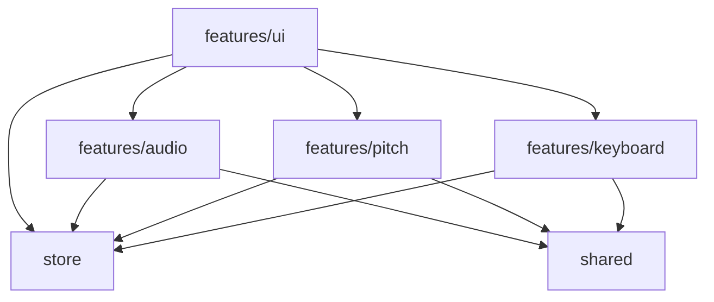

# Dependencies

## Internal Dependencies

### Mermaid Diagram

### Text Alternative
- **features/ui** (Layout, modals, walkthrough overlay) depends on:
  - **features/audio** (renders mic toggle, level meter, and sensitivity controls).
  - **features/pitch** (attaches the pitch detection loop hook).
  - **features/keyboard** (embeds the SVG virtual keyboard component).
  - **store** (reads theme status, active note, and note history).
- **features/audio** (mic streaming hook) depends on:
  - **store** (updates volume level RMS and active listening state).
  - **shared** (uses FFT constants and type definitions).
- **features/pitch** (pitch estimation hook) depends on:
  - **store** (updates detected notes and history log).
  - **shared** (references piano geometry converters and constants).
- **features/keyboard** (virtual layout component) depends on:
  - **store** (reads active note to toggle HSL glow styling).
  - **shared** (references SVG shape mappings and dimensions).

## External Dependencies

### pitchy
- **Version**: `^4.0.7`
- **Purpose**: Real-time autocorrelation algorithm evaluating fundamental frequency and clarity.
- **License**: MIT

### zustand
- **Version**: `^4.5.4`
- **Purpose**: Coordinates reactive changes across UI panels, sliders, and visual overlays.
- **License**: MIT

### fast-check
- **Version**: `^3.19.0`
- **Purpose**: Property-based tests verifying frequency-to-MIDI conversions and bounds invariants.
- **License**: MIT
